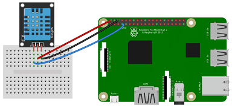
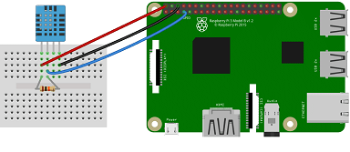

# SmartStrawberryGreenhouse

## Introduction
*SmartStrawberryGreenhouse* is an IoT-GreenHouse project to grow strawberries. The main goal is do it out of season, using indoor illumination and monitoring temperature and humidity to keep them into the required ranges.

## Requirements
Basic experience with raspberries 3/4 and python3 for the IoT stuff. Python3 and pip3 installed.

## Project components
### Orchard
#### Description
Strawberries are planted in a single circular pot (40 cm. diameter), inside a custom wooden box (60x60x60 cm aprox).
#### Illumination
I have used a 50W led light, workin with freqs 630-660 nm, 430-460 Nm and 3000-65000k.
It is one of the cheapest, surely you can find better indoor led lights.

#### IoT telemetry
A raspberry 3 model b+ with raspbian strech (no desktop) with a DHT11 sensor (temperature+humidity) is used to send telemetry to ThingsBoard.
The job is scheduled with "crontab", runs each hour and calls a python script.
### IoT Server
*Thingsboard*, an open source IoT server (http://thingsboard.io/) has been configured in a Raspberry 4 (you can use also Raspberry 3 or any other computers, check ThingsBoard requirements).
## IoT devices
For this project you need at least 1 device to make:
- Read temp/humidity and send data to IoT server
- Host IoT server
- Manage water
- Manage light
- Take orchard pics

A Raspberry 3 or 4 should work if you don't waste resources and performance (check ThingsBoard setup for raspberry, Thingsboard will be the heaviest resource for the device).

I have used a Raspberry 4 with ThingsBoard and a Raspberry 3 for all the other things, because I had that ThingsBoard server running at home for other projects.

## How-to
You can choose what to plant and how (# of pots, light, orchard sizes, ...). But I'm going to explain how I have configured the IoT stuff: 
- Temp/humidity sensor, how to read and send to IoT server
- How to manage water (in progress)
- How to take pics (in progress)
- How to manage light

### Temperature and Humidity adquisition with sensor DHT11
DHT11 has 2 versions: with or without board. I have the one with board. Without board you will also need a 10K resistor. These are the connections with raspberry GPIO




#### Python code
This tutorial works with Python3. Code references python executable as "python3". If your python3 executable is "python", change "python3" with "python" in the next code examples.

You will need to install the Adafruit DHT11 library. Make sure you have git installed:
```
sudo apt-get install git-core
```
Clone the library project:
```
git clone https://github.com/adafruit/Adafruit_Python_DHT.git
```
Install dependencies:
```
sudo apt-get install build-essential python-dev
```
And install the library:
```
cd Adafruit_Python_DHT
sudo python3 setup.py install
```
Make sure you have wired the sensor to the Raspberry GPIO, and test it with this sample code:
```
import sys
import Adafruit_DHT
import time

humidity, temperature = Adafruit_DHT.read_retry(11, 4)
print('Temp: {0:0.1f} C  Humidity: {1:0.1f} %'.format(temperature, humidity))
```
Check file *sensor.py* for a full example sending data to IoT server (ThingsBoard) with MQTT.


